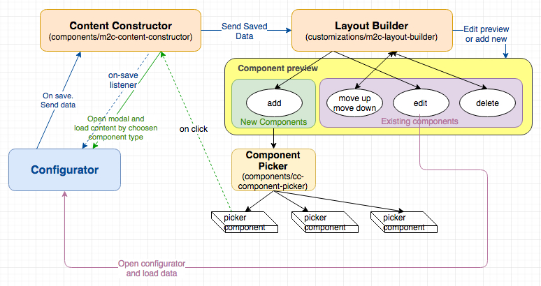
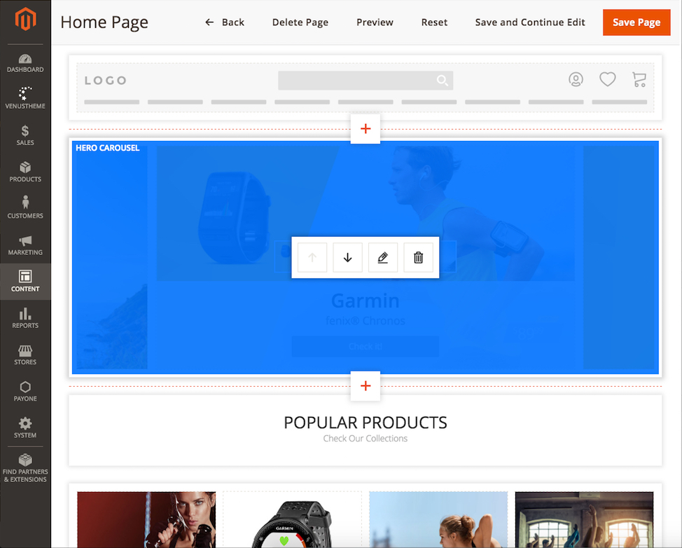
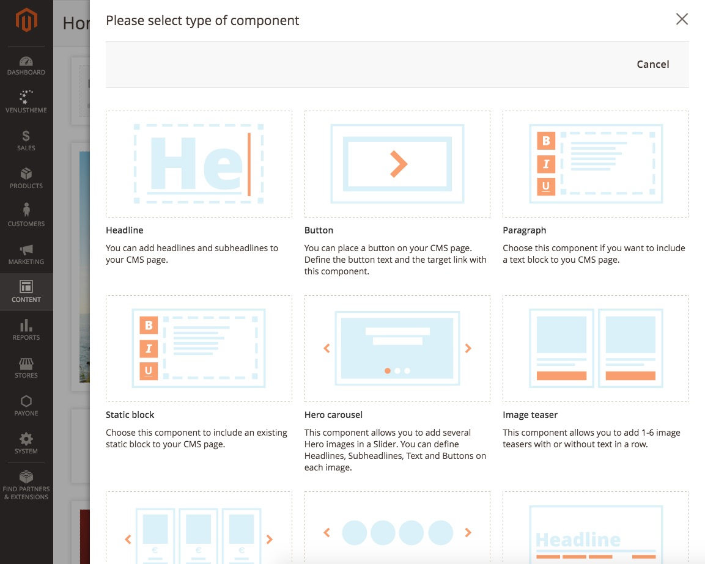
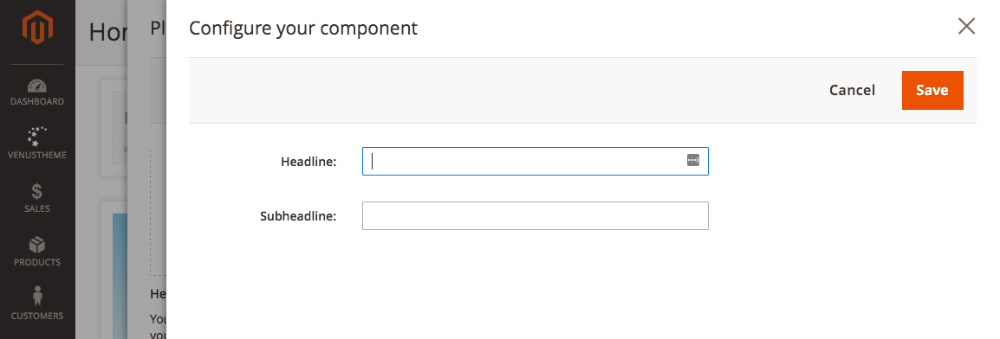
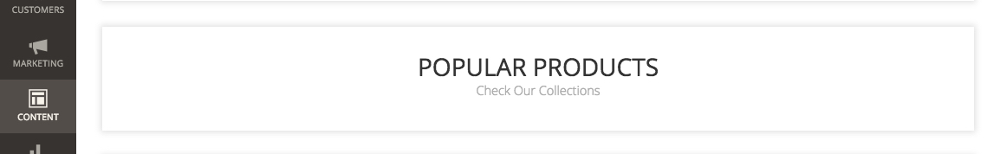

## MageSuite Content Constructor Admin

This module adds a functionallity of Content Constructor CMS, a powerful tool, for building a content of pages that replaces Magento Page Builder.
Admin module stands for the whole configurator of components, used in product edit pages, category pages, cms blocks, etc.


## How it works?


### Definitions:

-   **Content Constructor (CC)** - a mother (root) component that in fact controls whole CC functionality _(vendor/creativestyle/magesuite-content-constructor-admin/view/adminhtml/templates/constructor.phtml, vendor/creativestyle/magesuite-content-constructor-admin/view/adminhtml/src/content-constructor.ts);_

-   **Layout Builder** - component responsible for displaying CC dashboard and management tools for each component _(vendor/creativestyle/magesuite-content-constructor-admin/view/adminhtml/src/components/_layout-builder/*);_

-   **Management tools** - tools that allows to modify component's data or its position. Currently available: _add new component_, _move up, move down, edit, delete, duplicate._ Tools are part of _cc-layout-builder_ component

-   **Component Picker -** when you want to add new component, a modal appears with the _Component Picker_ as content. We used here Magento's modal system, but the picker is our solution. The _Component Picker_ is a list of available component types you can choose from. _(vendor/creativestyle/magesuite-content-constructor-admin/view/adminhtml/src/components/_component-picker/*)_
-   **Component Preview** - this component is responsible for displaying preview of configured component. This means that when you create configurator component you have to create preview component for this configurator as well. It is displayed in the dashboard of **Layout Builder**

-   **Configurator -** this is in fact already a component you have chosen. It's loaded to the separate modal as a form and it's responsible for collecting information and content of what should be displayed on the storefront. Currently there are following component types:

    - **Headline** - Simply places headline and optional subheadline

    - **Button**_-_ As name says, it puts the button element. You can set label and target where it should redirect you

    - **Paragraph**- This one is quite powerfull, because it not only creates text input but provides simple version of WYSIWYG Editor and after save it creates CMS static block in Magento's system using REST API.

    - **Static Block** - this just puts CMS Static block, but content of it cannot be edited directly inside configurator

    - **Hero carousel** - adds Hero component which is always 1 slide per view but you can choose also mobile display scenario: remove carousel funcitonality and display banners one under another OR keep slider funcitonality

    - **Image Teaser** - similar to hero carousel but more powerfull. It allows you to choose how many slides per view you want to display, Should it be slider, full-width or content width and much more.

    - **Product Carousel** - display slider with products from choosen category (or multiple categories), sort it, decide how many products you want to show there.

    - **Brand Carousel** - if brands extension is enabled you can put this component to show brands of your shop. This component is unique because it doesn't provide any configuration options. In fact this component is not a real component. It's controlled by **Content Constructor** and does not have his own filesystem as configurator

    - **Category links** - Choose category and then subcategories you want to display on your page. It shows category label and under it a list of linked subcategories you have chosen. Next to component label there's "Show all" which redirects you to the category page

    - **Separator** - Another component which is not a real component. It simply puts "<hr>" Does not have his own filesystem as configurator


### Files structure

All of mentioned components are available in extension files, in 'src' catalog, which is then compiled by gulp and distributed to Magento locations.
Paths below are continuation of a base path, that is common for all CC components: _vendor/creativestyle/magesuite-content-constructor-admin/view/adminhtml/src/*._

- Content Constructor - ./_content-constructor.ts, ./content-constructor.scss_

- Layout Builder - _./components/_layout-builder/*_

- Component Picker - _./components/_component-picker/*_

- Configurator components - _./components/{component_name}/configurator/*_

- Preview components - _./components/{component_name}/preview/*_


### How to create component (Frontend part)

> Fair warning
> This document covers only admin part of a component. Frontend is being built exactly the same way all the Magento template are done. Storefront templates can be found under `vendor/creativestyle/magesuite-content-constructor-frontend/view/frontend/templates/component/{component-name}.phtml`.

Content Constructor is fully based on Vue.js so if you're not familiar please read some about it first: [http://vuejs.org/](http://vuejs.org/)

#### 1. Request a BE part of the component
First of all, you'll need a backend developer who will prepare logic for getting configurator inside modal and passing data to it as well as passing its data to the storefront. In this step you'll need to tell him what's the path for your component in the admin panel. Let's say we want to add component which is responsible for adding headline (I know this component already is there, but you can also follow this guide in your editor and check the filesystem on your own). So let's call it simply **headline** and tell BE guy that this component will be reachable under `headline/configurator/headline.phtml`

Also we ask graphic designer for the icon for **component picker** if we don't have it yet.

#### 2. Create base component files
Meanwhile you can already prepare the component which can be used in Magento admin. So having all backend things done, we can already create architecture for our component. All the directories/files we need we will create in _vendor/creativestyle/magesuite-content-constructor-admin/view/adminhtml/src/components:_

- _headline/configurator/headline.phtml_
- _headline/configurator/headline.ts_
- _headline/configurator/headline.scss_
- _headline/preview/headline.ts_
- _headline/preview/headline.scss_


_headline/configurator/headline.phtml_

```
<?php /** @var $block \MageSuite\ContentConstructorAdmin\Block\Adminhtml\Component\Headline */ ?>
<headline-configurator class="cc-headline-configurator <?=$block->getClasses()?>" :configuration="initialComponentConfiguration" :cc-config="ccConfig"></headline-configurator>
```

This file defines usage of a Vue component with **:configuration** prop that will keep our data we provided.
It's important when we edit component, because when editing we want all data that are currently there to be already pre-defined.
Please pay attention to the tag. It should always contain component name and a **-configurator** suffix.
Next thing is css class of our component, we are prefixing it with **cc-** to avoid potential conflicts with Magento or 3rd party

_headline/configurator/headline.ts_

First we import **componentConfigurator** which contains all logic needed for setup component.
It's useful to write an interface of all out properties (all things that can be provided by user). This will make maintenance easier and make component more readable.
Then we define new Vue component in a **const** called **headlineConfigurator** (notice a relation between file name and name of this const) and mix in **componentConfigurator** into it using native Vue's **mixins** property.
Next step if to setup template with **v-model** arguments pointing to our props.
Then we define our **configuration** prop (the one we set in phtml as a **:configuration** argument), define its type and set all default values. In case of headline we want all inputs to be empty when creating new component so we define empty values for our names keys. Those will become replaced with the content of :configuration when component will be created once and we will only want to edit something.
At the very end we have to export our const so that it can be imported by **content-constructor**.

_headline/configurator/headline.scss_

Filling  is optional, if you're fine with the styles that are already provided (in case of this component we are fine because inputs are already styled) you can leave this file empty. In case you need to style something, remember to import this sass in _vendor/creativestyle/magesuite-content-constructor-admin/view/adminhtml/src/content-constructor.scss_ to applied your styling

#### 3. Confirm that configurator works
Now we have to make sure our configurator works , so let's "plug it" in a few steps:

Import your **headlineConfigurator** to the _vendor/creativestyle/magesuite-content-constructor-admin/view/adminhtml/src/content-constructor.ts_

```
...
import headlineConfigurator from './components/headline/configurator/headline';
...
```

Map if to the **components** property so that Vue could gather all information to run subcomponent of CC. For this find **components** property of **contentConstructor** and simply map it.
Remember to use the same names you defined in your phtml and ts files:

```
...
'headline-configurator': headlineConfigurator
...
```

Save it => build using gulp/yarn
Clear all the caches, pub/static/* and browser cache, check if configurator displays for you after you chose your component from the picker.
It should. If not, please check what does your console return for this component.
If it's not a JS error but rather **500** response from the server (it's loaded with AJAX request with GET method) simply check the response content
and it should give you the error report number that you can read in your filesystem.


#### 4. Prepare a layout builder
Now when our configurator is ready and it's working as we wanted, it's time to make a preview for **layout builder**.

Let's prepare .ts file with the template and style it a bit if needed:

_./headline/preview/headline.ts_

As you probably noticed we are using similar interface as we already prepared for configurator.
It's because we will use those keys to display data provided by the user, means **component's configuration** which is essence of CC.
Also pay attention to the CSS class of this preview component - it should follow the pattern of: _cc-{component-name}-preview._


_./\_layout-builder/layout-builder.ts._
Let's now setup layout builder for our new preview component.
For this we have to import our ts first and then map it again just like we did with configurator:

```
import headlinePreview from '../headline/preview/headline';
```

map it in components object of **layout builder** component:

```
'headline-preview': headlinePreview
```

_./headline/preview/headline.scss_
This file contains styles for the headline preview.


_./\_layout-builder/layout-builder.scss_
To make it work we need to import this scss into our **layout-builder** component:
```
@import '../headline/preview/headline';
```

Build assets, clear caches and check if preview is displayed properly

#### 6 Add icon to the component picker

The very last thing left is to add the icon of our brand new component to the **Category Picker**. As in case of reading previews by layout builder,
the icon should be also read automatically, but only in one condition: the name of icon file, there's a pattern for it.

Let's call our icon _icon_component-{component-name}.svg_ (_icon_component-headline.svg_) and put it into our sprites directory which is loaded under _./images/sprites/_

Rebuild and test.

If you want to make the description of this component a bit more descriptive for the user in picker, you can edit it in _vendor/creativestyle/magesuite-content-constructor/src/Components/Picker/PickerAdmin.php._

#### 7.  We're done now! Test it deeply (remember about edit, duplicate functionalities etc).

# Custom Fields
Custom fields is a mechanism, that allows adding custom configuration fields to the existing content constructor components configurators, without overwiging whole content constructor admin extension.
Complete description about this feature can be found [here](docs/custom-fields.md).

# Custom CC Components
The above guide serves as a point of reference for development of MageSuite core, however, recent release ^4.1.0 introduced a support
for Custom Content Contructor Components that can be defined in other - custom modules.

Complete description about this feature can be found [here](docs/custom-components.md).

# Screenshots

### Layout builder - Dashboard with some components



### Component Picker


### Headline Configurator


### Headline preview in Layout Builder's Dashboard

